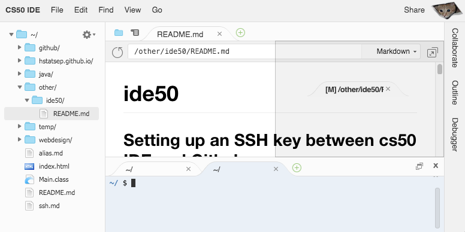
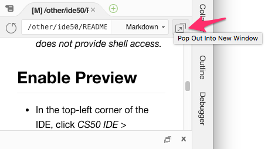

# ide50

## FOR EACH SECTION, READ EVERYTHING BEFORE YOU DO ANYTHING

Leave this window on the left half of your screen so that you can READ the directions.

Open a new window on the right half of your screen so that you can FOLLOW the directions.

Go to [ide.cs50.io](https://ide.cs50.io/) and login with your Github account

## Setting up an SSH key between cs50 IDE and Github

#### Configuring your user info

* In your command line, type the following: `git config --global user.email "you@example.com"`
  * Don't copy/paste.
  * Remember to use YOUR email address.
  * YES, you need the quotes.
  * Example: `git config --global user.email "johnd1234@hstat.org"`
* Then type `git config --global user.name "Your Name"`
  * Example: `git config --global user.name "John Doe"`

#### Generating and connecting an SSH key
* Copy/paste the following:
* `echo -e "\n" | ssh-keygen -t rsa -N ""`
* `cat ~/.ssh/id_rsa.pub` then copy _all_ of the result to your clipboard (it should start with `ssh-rsa`)
* Go to https://github.com/settings/ssh/new
  * Title: ide50
  * Key: paste your ssh key
  * Press the green **Add SSH key** button
* Back in your cs50 IDE, copy/paste the following
```
echo 'Host github.com' >> ~/.ssh/config
echo ' Hostname ssh.github.com' >> ~/.ssh/config
echo ' Port 443' >> ~/.ssh/config
echo ' StrictHostKeyChecking no' >> ~/.ssh/config
ssh -T git@github.com

```
* If you still see the last command in your terminal, press <kbd>ENTER</kbd>  
You should see
> Hi "username"! You've successfully authenticated, but GitHub does not provide shell access.

## Enabling Preview
* In the top-left corner of the IDE, click **CS50 IDE** > Preferences
* When the new window opens, on the LEFT side, click **User Settings**
* On the RIGHT side, toggle **Enable Preview** to **ON**
* You're done!
  * This means that in the future, you will be able to right-click on a file (i.e. HTML or Markdown) and click **Preview**
  * On a Mac, if you have a mouse with no right-click, hold <kbd>CONTROL</kbd> then click
  * Tip 1: Drag the new tab that appeared to the right side of your IDE _(similar to the image below)_

  * Tip 2: Use the pop-out icon to preview outside the IDE _(similar to the image below)_


## Enabling Auto-Save
* If you closed the Preferences tab, re-open it: **CS50 IDE** > Preferences
* When the new window opens, on the LEFT side, scroll down and click **Experimental**
* On the RIGHT side, change the **Auto-Save** dropdown to **On Delay**
* You're done!
  * This means that in the future, when editing a file, you will be see a red dot in the tab, next to the filename
  * A red dot means there are unsaved changes
  * After you stop typing, the red dot will turn back to an **X**
* You can also force a save by going to **File** > **Save** or using the keyboard shortcut (i.e. <kbd>⌘</kbd>+<kbd>S</kbd>)